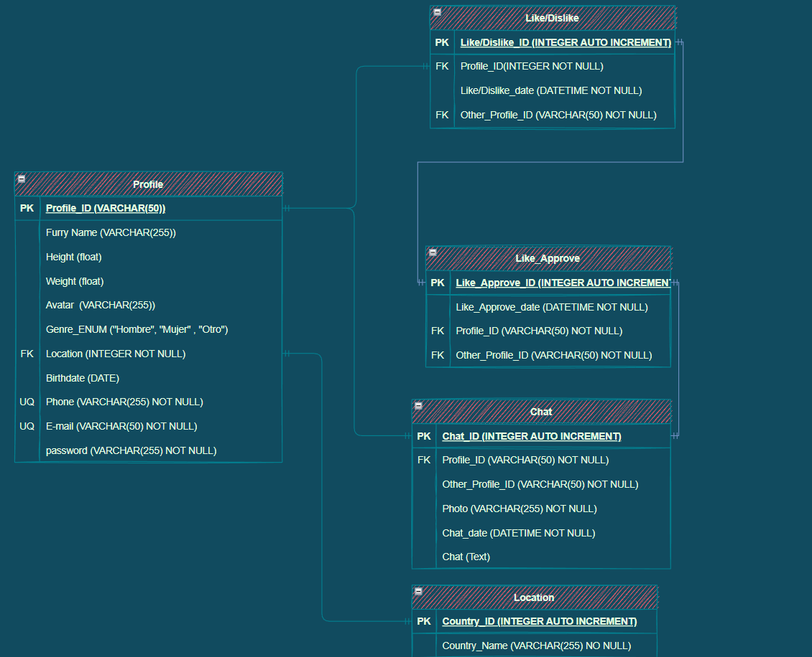

# Base de datos

## Entidades

1. Profile
2. Like / Dislike
3. Chat
4. Location

## Atributos

### Profile
- Profile_id (PK)
- Height 
- Weight 
- Avatar
- Genre 
- Birthdate
- Location (FK)
- Phone (UQ)
- E-mail (UQ)
- Password

### Like / Dislike

- Like/Dislike ID (PK)
- Profile ID (FK)
- Date
- Other Profile ID (FK)

### Like Approve
- Like Approve ID
- Date
- Profile ID (FK)
- Other Profile ID (FK)

### Chat

- Chat ID (PK)
- Profile ID (FK)
- Other Profile ID
- Photo
- Chat Date
- Chat

### Location

- Country ID (PK)
- Country Name (FK)

## Relaciones

1. Los _Profile_ ven otro _Profile_  (1-M)
2. Los _Profile_ dan _Like / Dislike_ (1-M)
3. Los _Profile_ tiene _Like / Dislike_ (1-M)
4. Los _Profile_ chatean con otros _Users_ (1-M)
5. Los _Profile_ tienen _Location_(1-1)

## Catálogo 

- México
- EUA
- Perú
- Haití

# Modelo Relación

[Regresar](/morales-pedro-practica-3/README.md)

## Reglas de Negocio

### Profile

1. Crear perfil
2. Ver perfiles
3. Editar perfil
4. Eliminar perfil

### Like / Dislike

1. Crear Like / Dislike de Profile en otro Profile
2. Eliminar Like / Dislike de Profile en otro Profile

### Like Approve

1. Crear Like de un Profile y Otro Profile

### Location

1. Crear Location
2. Leer todos las Location
3. Actualizar location

## Corrida de Datos

[Enlace](https://github.com/MasterPedro1/morales-pedro-practica-3/blob/main/Corrida_de_Datos.xlsx)
